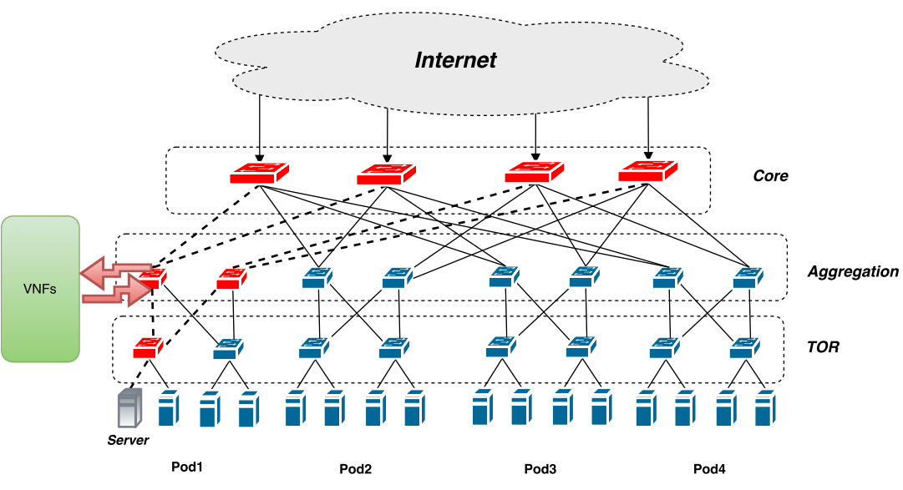
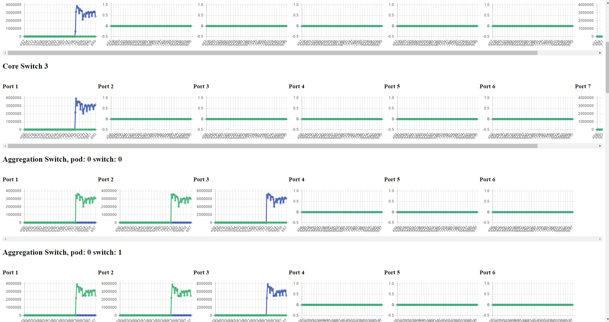

# SDNFV DDoS experimental scripts and tools

## Mininet evaluation topology

The mininet evaluation system is setup to look like a traditional FatTree
topology with a span of 4. The figure below represents the topology.



### Environment

The evaluation has been tested on:
  * OpenvSwitch 2.6.0, earlier versions of OVS might work but there are known
  issues with the multi-path bucket selection.
  * Mininet 2.3.0d1

### Running the Mininet topology
```
$> sudo mn --topo fattree \
           --custom topofattree.py \
           --controller=remote,ip=127.0.0.1
[...]
mininet>
```

## Ryu Controller

This source code contains two applications for the Ryu controller, the first one
is responsible for configuring the buckets for the Equal Cost Multi Path (ECMP)
hashing as well as inserting the flow table entries. The second application
monitor and display in real time the port statistics across the entire fabric
for debugging and telemetry.

### Environment

The code was tested working with Ryu version 4.7

### Running both applications
```
$> ryu-manager ddosrouting.py portstats.py
loading app ddosrouting.py
loading app portstats.py
loading app ryu.controller.ofp_handler
creating context wsgi
instantiating app ddosrouting.py of DDOSRouting
instantiating app ryu.controller.ofp_handler of OFPHandler
instantiating app portstats.py of PortStats
(19290) wsgi starting up on http://0.0.0.0:8080
[...]
```

### FatTree ECMP multi-path routing

This application uses OpenFlow groups to perform EMCP forwarding.

The groups on the switches can be observed using:

```
sudo ovs-ofctl dump-groups es_0_0 --protocols=OpenFlow13
OFPST_GROUP_DESC reply (OF1.3) (xid=0x2):
group_id=1,type=select,bucket=actions=set_field:02:01:00:01:00:00->eth_src,output:1,bucket=actions=set_field:02:01:00:01:00:00->eth_src,output:2
```

And the forwarding entries:
```
sudo ovs-ofctl dump-flows es_0_0 --protocols=OpenFlow13
OFPST_FLOW reply (OF1.3) (xid=0x2):
 cookie=0x0, duration=281.187s, table=0, n_packets=0, n_bytes=0, priority=3,in_port=6 actions=goto_table:1
 cookie=0x0, duration=281.187s, table=0, n_packets=0, n_bytes=0, priority=3,arp actions=CONTROLLER:65509
 cookie=0x0, duration=281.187s, table=0, n_packets=0, n_bytes=0, priority=1 actions=goto_table:1
 cookie=0x0, duration=281.187s, table=1, n_packets=0, n_bytes=0, priority=2,dl_dst=02:00:00:00:00:00 actions=output:3
 cookie=0x0, duration=281.187s, table=1, n_packets=0, n_bytes=0, priority=2,dl_dst=02:00:00:00:00:01 actions=output:4
 cookie=0x0, duration=281.187s, table=1, n_packets=0, n_bytes=0, priority=1 actions=group:1
```

### Port Statistics Monitoring

This application uses WSGI to start a WebUI displaying the port statistics of
all the switches in the fabric to simplify debugging, observe the fair
distribution of traffic across the multiples paths and otherwise monitor the
behaviour of the network.

By default the WSGI server is running on port 8080 on the host running the ryu
application. For instance if the Ryu controller is running locally, the port
statistics are available at http://localhost:8080



## Simulating a DDoS Attack

The easiest way to emulate a DDoS attack in the provided environment is using
the hping tool. Using hping we can emulate a UDP flood by sending a large amount
of traffic from random source IP addresses to a destination host.

In this setup, the command below can be used to generate an attack on the target
`10.0.0.1`.

```
hping3 --udp --flood -d 1472 --rand-source 10.0.0.1
```

In `tools\dnsamplification` we provide a simple script showcasing the DNS
amplification attack.

## TCP latency tool
This tool is based on the original code by Graham King available on GitHub at
the address https://github.com/grahamking/latency. However, we have modified
the code to send SYN requests at a regular interval for continuous measurements
and keep track of the pending packets to track packet loss.

### Building
This tool is already pre-built in the repository, however if you want to compile
it yourself the commands are the following on Ubuntu 16.04

```
$> sudo apt-get install golang-go
$> go build latency.go tcp.go
```

### Running
The tool required raw IP sockets to craft the TCP SYN packets and listen for the
replies. On most distributions raw IP socket require root privileges.

```
$> sudo ./latency --help
Usage of ./latency:
-I string
    Interface (e.g. eth0, wlan1, etc)
-h    Print help
-i int
    ms interval between pings (default 1000)
-p int
    Port to test against (default 80) (default 80)
```

e.g, To measure the latency with host 10.0.0.1 at a 100ms interval
```
$> sudo ./latency -i 100 10.0.0.1
2016/12/02 12:02:12 sendTime: 1480680132567452000       receiveTime: 1480680132568407324        latency: 955.324µs
2016/12/02 12:02:12 sendTime: 1480680132666903663       receiveTime: 1480680132667834501        latency: 930.838µs
2016/12/02 12:02:12 sendTime: 1480680132767414823       receiveTime: 1480680132768359849        latency: 945.026µs
[...]
```

use Ctrl + C to stop the measurement and display the packets that have been lost

## FAQ
  * I get the error message `ovs-ofctl: dump-groups needs OpenFlow 1.1 or later ('-O OpenFlow11')`
    * Make sure to specify the protocol after the ovs-ofctl command using --protocols=OpenFlow13
  * I can't see the latency increasing even though the DDoS is taking place
    * Make sure the machine you are running the experiment on is powerful
    enough, otherwise hping won't be able to saturate the links.
